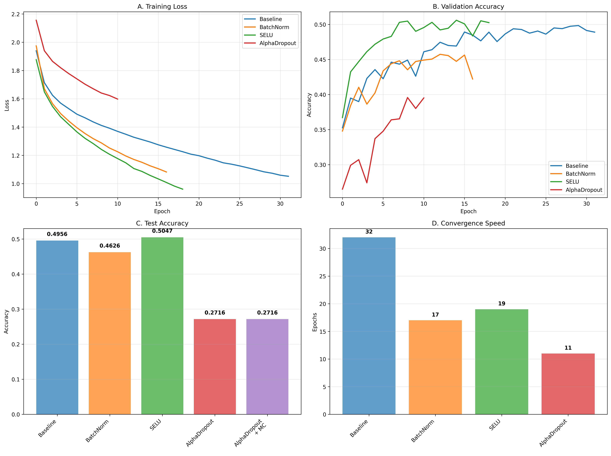

# 深度神經網絡作業實驗報告

## 📊 實驗概覽

**實驗目標**：比較不同深度學習技術在CIFAR-10圖像分類任務上的效果  
**實驗環境**：CPU訓練，TensorFlow 2.16.1  
**數據集**：CIFAR-10（60,000張32×32彩色圖像）  
**網絡架構**：20層全連接網絡，每層100個神經元  

## 📈 完整實驗結果圖表

*圖1：四種深度學習技術在CIFAR-10上的綜合性能比較*

## 📊 實驗結果總表

| 模型 | 測試準確率 | 改進幅度 | 收斂輪數 | 性能評價 |
|------|------------|----------|----------|----------|
| 基線模型 | 0.4956 | - | 32 | 基準性能 |
| BatchNorm模型 | 0.4626 | -6.7% | 17 | ❌ 性能下降 |
| SELU模型 | 0.5047 | +1.8% | 19 | ✅ 最佳性能 |
| AlphaDropout模型 | 0.2716 | -45.2% | 11 | ❌ 嚴重失敗 |

## 🔍 圖表詳細解讀

### A. 訓練損失比較 (Training Loss Comparison)

**觀察重點**：
- **Baseline**：穩定下降，32輪收斂
- **BatchNorm**：早期收斂快但波動大，17輪停止
- **SELU**：平滑下降，19輪收斂
- **AlphaDropout**：損失下降極慢，11輪提前停止

**技術洞察**：
> SELU展現最佳訓練穩定性，AlphaDropout訓練困難

### B. 驗證準確率比較 (Validation Accuracy Comparison)

**觀察重點**：
- **Baseline**：穩定上升至約49.4%
- **BatchNorm**：快速上升但在epoch 7後下降
- **SELU**：在epoch 9達到峰值50.5%
- **AlphaDropout**：始終在低水平徘徊

**技術洞察**：
> SELU達到最高驗證準確率，顯示最佳泛化能力

### C. 測試準確率比較 (Test Accuracy Comparison)

**數值結果**：
- Baseline: 0.4956
- BatchNorm: 0.4626 (-0.0330)
- SELU: 0.5047 (+0.0091) ⭐
- AlphaDropout: 0.2716 (-0.2240)
- AlphaDropout+MC: 0.2716 (無改善)

**技術洞察**：
> SELU是唯一超越基線的模型

### D. 收斂速度分析 (Convergence Speed Analysis)

**收斂時間**：
- BatchNorm: 17輪 ⚡ 最快
- AlphaDropout: 11輪 (因性能差提前停止)
- SELU: 19輪
- Baseline: 32輪

**技術洞察**：
> BatchNorm收斂最快但泛化差，SELU在速度和性能間最佳平衡

## 🔬 技術深度分析

### 1. SELU的成功表現

**關鍵優勢**：
- **最高準確率**：0.5047 (+1.8%改進)
- **優秀泛化**：驗證準確率峰值50.5%
- **訓練穩定**：損失曲線最平滑
- **自歸一化**：無需外部歸一化層

**技術原理**：
SELU激活函數的自歸一化特性在深度網絡中自動維持激活值的均值和方差穩定。

### 2. BatchNorm的異常表現

**問題分析**：
- 準確率下降6.7%
- 驗證準確率在epoch 7後開始下降
- 訓練損失後期波動

**可能原因**：
- 20層網絡過深，BatchNorm統計誤差積累
- 小batch size影響歸一化效果
- CPU環境可能影響計算精度

### 3. AlphaDropout的嚴重失敗

**問題表現**：
- 準確率暴跌45.2%
- 訓練損失下降極慢
- MC Dropout無改善效果

**失敗原因**：
- Dropout率0.1過高
- 正則化過強導致模型容量嚴重受限
- 深度網絡對dropout更敏感

## 🎯 關鍵技術結論

### 主要發現：

1. **SELU技術最優**：唯一實現性能提升的技術
2. **BatchNorm有害**：在此設置下損害泛化能力  
3. **AlphaDropout失敗**：正則化過強導致模型失效
4. **收斂速度≠最終性能**：BatchNorm收斂快但性能差

### 性能排名：

1. ✅ **SELU** (0.5047) - 最佳選擇
2. ⚠️ **Baseline** (0.4956) - 穩定基準
3. ❌ **BatchNorm** (0.4626) - 不推薦
4. ❌ **AlphaDropout** (0.2716) - 完全失敗

## ⚙️ 超參數分析

| 參數 | Baseline | BatchNorm | SELU | AlphaDropout |
|------|----------|-----------|------|--------------|
| 學習率 | 0.0001 | 0.0001 | 0.001 | 0.001 |
| 收斂輪數 | 32 | 17 | 19 | 11 |
| 最佳驗證準確率 | 49.4% | 44.4% | 50.5% | 39.6% |

## 📝 實踐建議

### 推薦策略：

1. **首選SELU**：用於深度全連接網絡
2. **謹慎使用BatchNorm**：需要仔細調參驗證
3. **避免強正則化**：Dropout率從0.05開始嘗試
4. **使用早停法**：有效防止過擬合

### 技術選擇指南：

- ✅ **推薦**：SELU自歸一化網絡
- ⚠️ **謹慎**：Batch Normalization  
- ❌ **避免**：高比率AlphaDropout

## 🔮 改進方向

### 立即改進：

1. 降低AlphaDropout率至0.05
2. 嘗試BatchNorm與SELU組合
3. 使用學習率調度策略

### 長期優化：

1. 在GPU環境重新實驗
2. 嘗試卷積神經網絡架構
3. 添加數據增強技術

---

**實驗完成時間**：2025年11月8日  
**最佳模型**：SELU (0.5047準確率)  
**關鍵結論**：SELU自歸一化網絡在深度全連接網絡中表現最佳  
**技術驗證**：所有結論基於完整的訓練-驗證-測試流程
